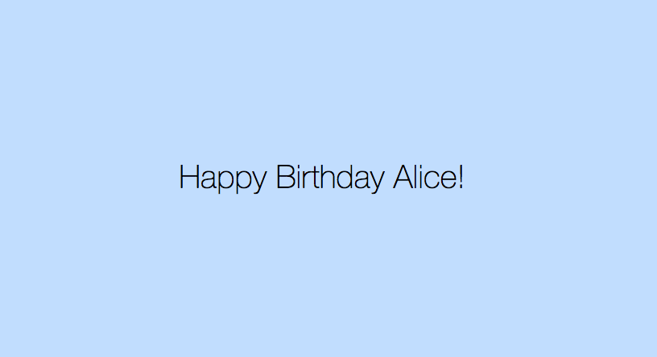

# Post-Challenge 2: Birthday App

Your challenge is to build a web app that will ask the user for a name and birthday.

When the user submits the form, and depending on the current date, the app will either:
- wish the user happy birthday
- tell them how long they'll have to wait until their next birthday

### User stories
```
Ask the user for their name and birthday
```
```
Wish the user a happy birthday or tell them how long until their next birthday
```

## Proposed screens:

Here are some suggested screens, but feel free to change the content, style and flow to make it your own.





